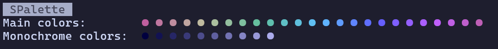
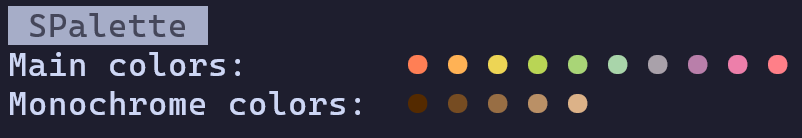
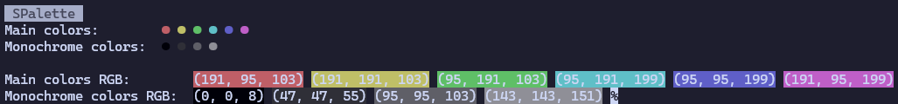

# SPalette
A simple palette/colorscheme generator written in C
# Examples
  
  
  
# Usage
The tool consists of:
```
Quantity of main colors
Quantity of monochrome colors
Main color saturation
Tint color RGB
Mix factor between main and tint (1 - 100)
```
# Installation
```
git clone https://github.com/danilaxila3/spalette.git
cd spalette
make
```
GCC needs to be installed  
Run `./spalette` (or `.\spalette` on Windows) to begin
